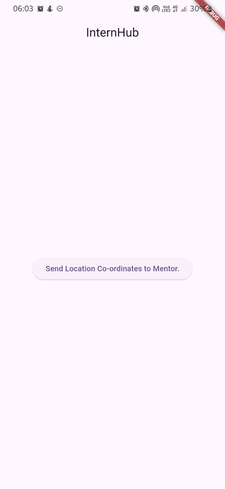
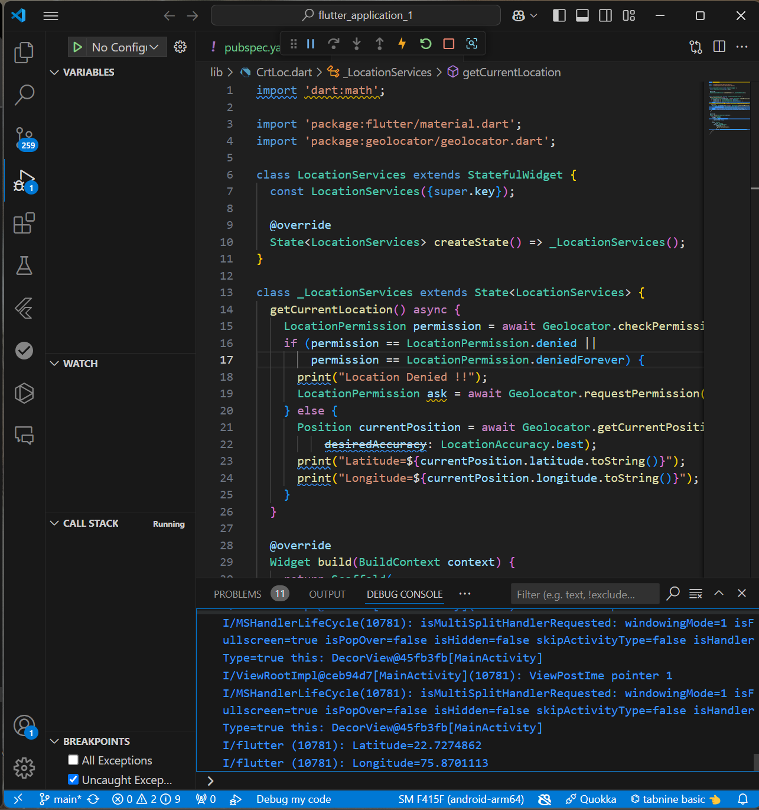

# flutter_application_1

Due to shortage of time, we couldn't add FETCH API, the idea was using FETCH and HTTP in-order to transfer the coordinates to the front-end of intern. From where he/she would be able to send the fortnightly andd monthly reports.

Screenshots are attached below:

Mobile app, where interns can fetch the location using GeoLocator

The exact coordinates of the intern, precise upto 10meters, in the terminal.

